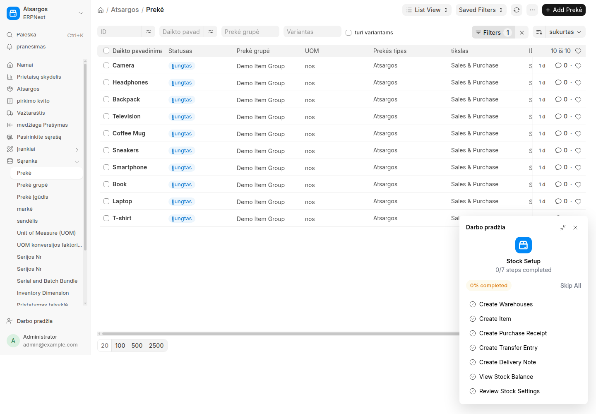

# One-Time Smoke Report

Status: **passed with a documented database override**

This one-time smoke was run on `development.localhost` on 2026-09-20. Browser automation remains issue #6 scope. The site already contained a contextless Lithuanian `Translation` row for `Item` whose value was also `Prekė`; therefore the browser result proves the effective UI value, while the verifier's app-only check separately proves catalog origin.

## Pinned Target

| Field | Required value | Observed value |
| --- | --- | --- |
| Frappe version | 16.34.0 | 16.34.0 |
| Frappe commit | `c1f1e8ec3708750d7254f7f99d869ffb9886f19f` | `c1f1e8ec3708750d7254f7f99d869ffb9886f19f` |
| ERPNext version | 16.35.0 | 16.35.0 |
| ERPNext commit | `12cd563fb9a79731f75ae2a45b1446a0a2dd9e74` | `12cd563fb9a79731f75ae2a45b1446a0a2dd9e74` |
| Python version | exact 3.14.x output | 3.14.7 |
| Babel version | 2.16.0 | 2.16.0 |
| App order | `frappe`, `erpnext`, `frappe_lt` | `frappe`, `erpnext`, `frappe_lt` |
| Database override | report contextless Lithuanian `Item` rows | `746e158c5f`: `Prekė` |

## Commands

The app was added after ERPNext and installed with:

```bash
bench get-app --skip-assets frappe_lt /tmp/frappe-lt-source
bench setup requirements --python
bench --site development.localhost install-app frappe_lt
bench --site development.localhost list-apps --format json
```

The reusable verification command was then run from the bench root:

```bash
bench --site development.localhost execute frappe_lt.verify.run \
  --kwargs '{"site":"development.localhost","mode":"local"}'
```

Observed command evidence:

- Two clean `bench compile-po-to-mo --app frappe_lt --locale lt --force` builds completed.
- First SHA-256: `0567500572f35d9f1ea41421bb00f0efca56625eaa011d8a817ceb6e36159744`.
- Second SHA-256: `0567500572f35d9f1ea41421bb00f0efca56625eaa011d8a817ceb6e36159744`.
- Both equal the single repository constant `frappe_lt.verify.EXPECTED_MO_SHA256`.
- Frappe and ERPNext app-only catalogs omitted contextless Lithuanian `Item`; adding `frappe_lt` returned `Prekė`.
- Server and boot caches were cleared through `bench --site development.localhost clear-cache`.
- Effective `frappe._("Item", lang="lt")` returned `Prekė`.
- The command warned that row `746e158c5f` masks effective runtime origin; it did not use the database-backed result as app-origin proof.

The unit suite and transactional database-masking integration test also passed on this bench.

## Browser Check

After the server-cache command, the browser check used a newly created Chrome profile with no prior site data. The profile signed in as `Administrator`, opened the route, and captured the screenshot below.

| Field | Evidence |
| --- | --- |
| Route | `http://development.localhost:8000/app/item` (`/app/item`) |
| Browser and version | Google Chrome 151.0.7922.137, headless |
| Browser cleanup method | New one-time profile at `/tmp/opencode/frappe-lt-chrome` |
| Visible result | `Prekė` in the breadcrumb, sidebar, and Add button; passed |
| Timestamp | `2026-09-20T12:42:09+03:00` |
| Screenshot | [`evidence/item-preke.png`](evidence/item-preke.png) |


